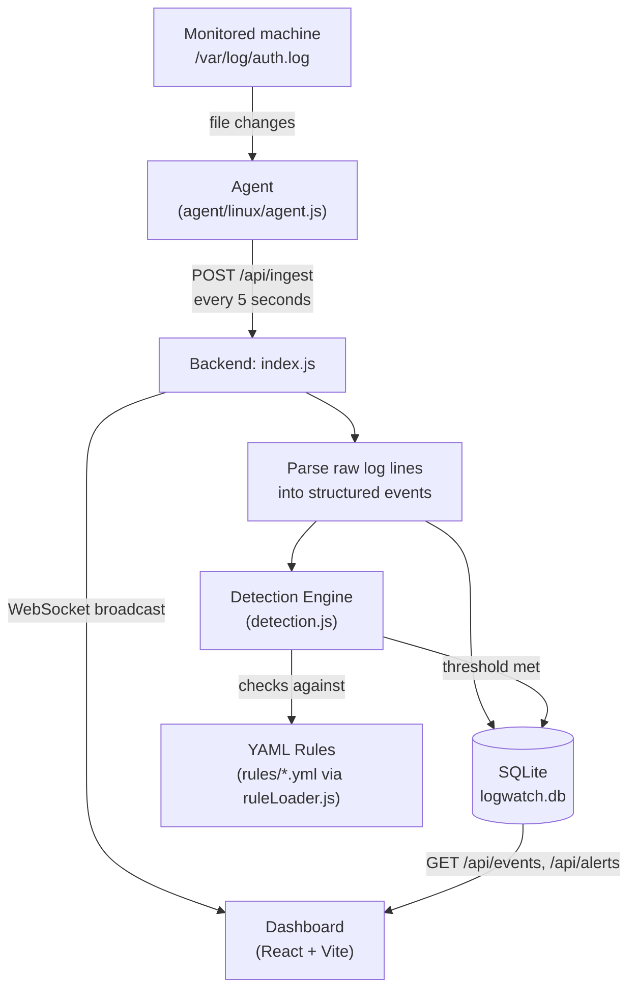

# Log Watch live

A self-hosted mini-SIEM: it watches log files on machines you own, detects suspicious activity in real time using a YAML-based rule engine, and displays everything on a live dashboard.

Built to understand — from first principles — how real SIEM platforms like Splunk and Elastic Security actually work under the hood: ingestion, parsing, detection, alerting, and visualization.

## Why this exists

Real systems generate thousands of log lines a day. No human can read all of it. This project demonstrates the full pipeline security teams rely on to turn that noise into a small number of actionable alerts:

```
raw logs → structured events → rule evaluation → alerts → live dashboard
```

## Architecture



**Flow summary:** a monitored machine's log file changes → the agent detects it and ships new lines to the backend → the backend parses and stores each event → every event is checked against all loaded YAML rules → matches become alerts → both events and alerts are pushed live to the dashboard over WebSocket, with no page refresh needed.

## Project structure

```
log-watch-live/
├── backend/
│   ├── src/
│   │   ├── index.js       # Express server, API routes, log parser
│   │   ├── db.js          # SQLite schema (endpoints, events, alerts)
│   │   ├── detection.js   # Generic rule evaluation engine
│   │   └── ruleLoader.js  # Loads all YAML rules from /rules at startup
│   └── logwatch.db        # SQLite database (created automatically)
├── agent/
│   ├── linux/
│   │   └── agent.js       # Watches a log file, ships new lines to backend
│   └── windows/
│       └── agent.ps1      # Polls Security Event Log, ships to backend
├── dashboard/              # React + Vite frontend
│   └── src/
│       ├── App.jsx
│       └── App.css
└── rules/                  # Detection rules (YAML) - add a file, no code changes needed
    ├── brute_force.yml
    ├── sudo_auth_failure.yml
    └── ... (13 rules total)
```

## How detection rules work

Rules are plain YAML - no code changes needed to add a new one. The engine is generic: it reads `event_type`, groups by a field (e.g. `source_ip`), and checks whether a threshold is crossed within a time window.

```yaml
title: Brute Force Login Attempt
id: bf-001
description: Detects 5+ failed logins from the same source IP within 5 minutes.
severity: high
detection:
  event_type: auth_failure
  group_by: source_ip
  threshold: 5
  timeframe_minutes: 5
```

**Currently included rules (13):**

| Rule | Detects | Severity |
|---|---|---|
| Brute Force Login Attempt | 5+ failed logins, same IP | High |
| Invalid User Enumeration | Login attempts against non-existent usernames | Medium |
| High-Volume Username Enumeration | Aggressive enumeration (15+ attempts) | High |
| Direct Root Login | Any direct root SSH login | High |
| Repeated Sudo Authentication Failures | Possible privilege escalation attempt | High |
| Abnormally High Volume of Sudo Commands | Automated/scripted bulk privileged actions | Medium |
| New User Account Created | Possible backdoor account | Medium |
| User Account Deleted | Account removal, needs review | Medium |
| Possible SSH Scanning Activity | Automated scanner signature | Low |
| SSH Key-Based Login | Baseline visibility | Low |
| Successful Login From New Source | Baseline visibility | Low |
| Sudo Command Executed | Audit trail visibility | Low |
| Multiple Failed Logins Across Different Accounts | Broader brute-force pattern, host-wide | High |

Alerts are deduplicated - a rule won't fire repeatedly for the same entity within its own timeframe.

## Setup

### Requirements
- Node.js
- SQLite3
- A Linux machine with a readable auth log (`/var/log/auth.log`) to monitor

### 1. Backend

```bash
cd backend
npm install
node src/index.js
```

Runs on `http://localhost:4000` by default. Custom port:
```bash
PORT=5050 node src/index.js
```

### 2. Agent

**Linux:**

Run on any machine you want to monitor (needs read access to the log file, typically via `sudo`):

```bash
cd agent/linux
sudo node agent.js
```

Environment variables:
```bash
BACKEND_URL=http://your-backend:4000/api/ingest LOG_FILE=/var/log/auth.log sudo node agent.js
```

**Windows:**

Polls the Security Event Log (Event IDs 4625, 4624, 4720, 4726 - failed/successful logins, user created/deleted) instead of tailing a text file, since Windows doesn't expose logs as plain text. Formats each event to match the same log-line style the backend already parses, so no backend changes are needed to support it.

Run in an **Administrator PowerShell** (Security log requires elevated access):

```powershell
cd agent\windows
.\agent.ps1 -BackendUrl "http://your-backend:4000/api/ingest"
```

Optional parameters:
```powershell
.\agent.ps1 -BackendUrl "http://your-backend:4000/api/ingest" -PollIntervalSeconds 10
```

> **Note:** The Windows agent was developed and code-reviewed on a Linux dev machine, so it hasn't been run against a live Windows Event Log yet. The Linux agent has been fully tested end-to-end (real SSH logins → detected → alerted → shown on dashboard).

### 3. Dashboard

```bash
cd dashboard
npm install
npm run dev
```

Open the printed local URL (typically `http://localhost:5173`).

## API Reference

| Method | Endpoint | Description |
|---|---|---|
| `POST` | `/api/ingest` | Agent submits `{ hostname, os, logs: [...] }` |
| `GET` | `/api/events` | Returns the last 100 parsed events |
| `GET` | `/api/alerts` | Returns the last 100 alerts |
| `GET` | `/api/endpoints` | Returns all known reporting machines |
| `GET` | `/api/config` | Returns backend runtime config (e.g. port) |

The backend also runs a WebSocket server on the same port, broadcasting `new_events` and `new_alerts` messages the instant they occur.

## What I learned building this

- How SIEM ingestion pipelines work end to end: file watching → parsing → structured storage → rule evaluation → alerting
- Building a generic, data-driven rule engine (YAML in, no code changes to add detections) instead of hardcoding logic per rule
- WebSocket-based live updates vs. traditional request/response APIs
- Real debugging: alert deduplication (a single burst of events was firing duplicate alerts until a recency check was added), log rotation handling in the agent, and port/process management during development

## Limitations

This is a learning/portfolio project, not production security software:
- Log parsing currently covers common SSH/sudo patterns on Linux - not a general-purpose log parser
- No authentication on the API/dashboard - not intended to be exposed to the public internet
- SQLite is fine for a single-host demo; a real deployment would need a proper database and horizontal scaling

## Author

Dipesh Pokhrel — [LinkedIn](https://www.linkedin.com/in/dipesh-pokhrel-2a6002375) | [GitHub](https://github.com/letxworld)